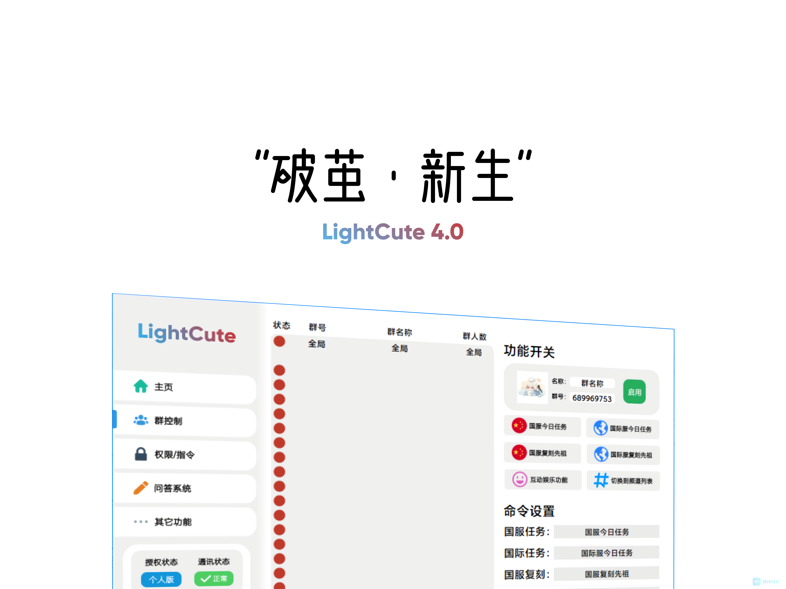
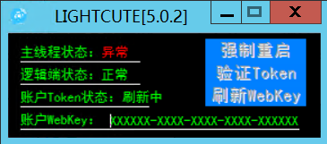
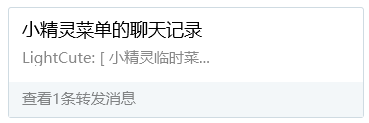
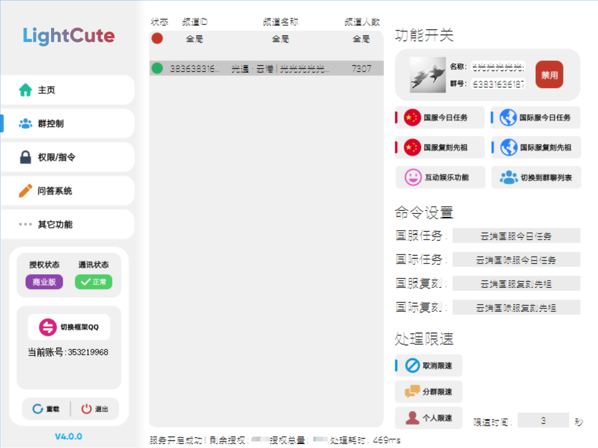

此插件由@小叮当 制作，UI视觉设计@kindyear，@光萌攻略组 为内容提供者， @柒彦为内容管理者，使用插件完全无需担心图片授权/版权问题，因为内容纯自制。

插件所有攻略内容源于【光萌攻略组】，用户交流请前往[光萌生产线：596934495](https://jq.qq.com/?_wv=1027&k=fYM8VZIP)。

从2020年12月15日至今，LightCute插件未收过一分钱的授权费用，一直用爱发电

如果未来推出了订阅制度，我们也会保证让插件的免费额度能够满足个人的需求使用，如果你是因为免费无偿给他人提供服务导致授权额度不够用，我们会免费无偿给你扩容

--- 

# 插件展示图

## 一些碎碎念

此【小精灵问答】非彼平常的小精灵问答，其实不然，包含了基础的【蜡烛查询】、【今日任务】、【天气预报】、【详细天气预报】，以及进阶的【参与活动】、【蜡烛统计】、【排队状态】、【游戏公告】、【白蜡数据】等功能（以后还会增加），以上小精灵菜单将进行折叠处理，有查阅需求的可自己点开，不会造成突然刷屏。

Q：从4.0至5.0 UI为啥不进反退？

A：目前还处于研发阶段，功能不断迭代的同时如果还兼顾UI，那将会大大延缓研发速度，我们的宗旨是《能用就行》，所以『LightCute 5.0』版本初代暂时采用极简风格UI。

**我们相信，温暖的灵魂终将相遇**

**因为热爱光遇，才能坚持开发这款插件**

**因为热爱光遇，才能坚持每天更新任务**

**因为热爱光遇，才能源源不断的输出攻略图**

--- 

# 插件介绍

本插件是一款光遇攻略插件（目前的发展方向有点超模），为了方便光之子们能更便捷的查看光遇任务&攻略，支持群聊&频道使用 本插件主要是通过云端同步攻略内容（这里以后再改）

> 【4.0】插件可以让你的机器人拥有以下功能
>> 『LightCute 4.0』版本已关闭，待5.0小精灵功能开发完全后将逐步补全
>>- 发送国服/国际服每日任务，可每个群单独自定义指令
>> - 发送国服/国际服最新复刻内容，可每个群单独自定义指令
>> - 指令开启/关闭攻略功能 可自定义指令 让你的机器人更个性化
>> - 可设置多个主人，可识别频道ID ，让你在群和频道开关自如
>> - 问答系统 （待开放）精准/模糊/正则
>> - 互动娱乐（待开发）

> 【5.0】插件可以让你的机器人拥有以下功能
>> - 攻略全全全全全全全
>> - 功能多多多多多多多

**插件所有攻略都由【光萌攻略小组】夜以继日的更新提供**

--- 

# 截图展示

--- 

# 演示动图

--- 

# 常见问题

> Q：插件收费吗？
> > A：插件目前是免费的，下载即可正常使用插件。

> Q：插件需要授权吗？
>> A：下载需加[光萌生产线](https://jq.qq.com/?_wv=1027&k=fYM8VZIP)按公告教程操作阅读并同意([《LightCute光萌插件用户服务协议》](https://club.skybay.cn/p/2-lightcuteterm)才可正常使用插件，无套路即可获得20个授权名额；更多授权额度尚未开放解锁，正在完善相关制度，请耐心等待。

> Q：授权额度怎么算的？
>> A：例如我拥有20个授权额度，这个额度是群和频道通用的，一个群占一个额度，一个频道也是占一个额度，满20个即满额度。

> Q：为什么需要授权？
>> A：这样做是为了更好的管理，以及避免插件使用过程中遇到的问题纠纷，可以先下载插件看一下再决定是否使用，如果确定要使用了再去获取授权。